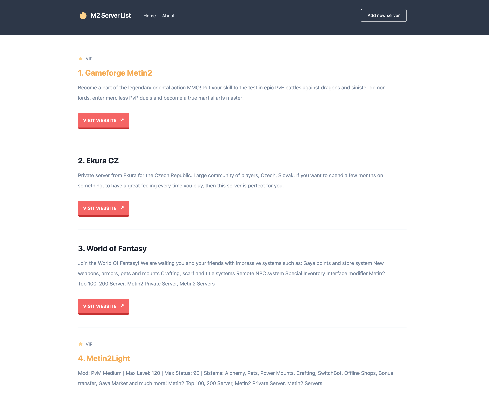

# **M2 Server List**

This project is powered by **PHP** based on VERY SIMPLE MVC framework and is created for a fun. I just wanted to play with a PHP a little.

Created with Tailwind CSS - the easiest use - for fun.

<br>



<br>

## Installation

Use these commands to install the dependencies and start the server.

1. **Clone from Github**

   ```
   $ git clone git@github.com:devmaroy/m2serverlist_cu_pe_php_csmvc_tlcss_en.git
   ```

2. **Navigate into your directory where you cloned repository**

   ```
   $ cd my-folder
   ```

3. **Download composer**

   ```
   $ https://getcomposer.org/download/
   ```

4. **Install composer**

   ```
   $ composer install
   ```

5. **Import MySQL database (.sql file in the repo)**

   ```
   $ m2serverlist.sql
   ```

6. **Start PHP up**

    ```
    $ php -S localhost:8888
    ```

   you can also use MAMP or something else.
<br>
<br>
**Your site is now running at `http://localhost:8888`!**

<br>

## Structure

A quick look at the top-level files and directories you'll see in my project.

    .
    ├── app
    ├── core
    ├── public
    ├── vendor
    ├── .gitignore
    ├── composer.json
    ├── composer.phar
    ├── config.php
    ├── index.php
    ├── README.md
    └── screenshot.png

<br>

1.  **`/app`**: This directory contains all the controllers, views and necessary files for this application.

2.  **`/core`**: This directory contains all the core code related to the custom MVC framework. You can find in this directory files for routing, helper functions and dependencies”.

3.  **`/public`**: Files for public - css, images.

4.  **`/vendor`**: Here you can find 3rd party packages with composer stuff.

5.  **`.gitignore`**: This file tells git which files it should not track / not
    maintain a version history for.

6.  **`composer.json`**: Configuration file for the composer.

7.  **`composer.phar`**: This directory contains composer stuff.

8.  **`config.php`**: Configuration file the application - database and other.

9.  **`index.php`**: Entry point for the application - everything starts here.

10. **`README.md`**: A text file containing useful reference information about
    project.

11. **`screenshot.png`**: Screenshot of the final website.

<br>

<hr>

<br>

### Live example:

**[m2serverlist.marekmatejovic.com](https://m2serverlist.marekmatejovic.com)**

<br>

Created by **[@devmaroy](https://twitter.com/devmaroy)** feel free to contact me

e-mail: **[hello@devmaroy.com](mailto:hello@devmaroy.com?subject=[GitHub]%20m2serverlist_cu_pe_php_csmvc_tlcss_en)**
